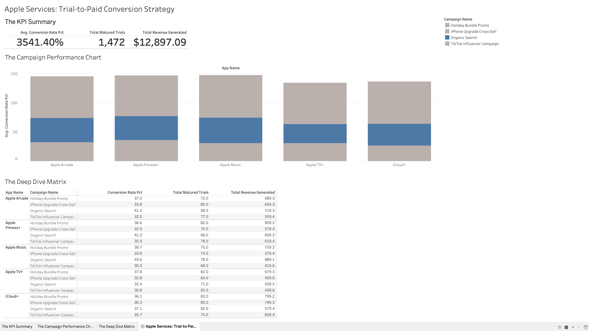

# Apple Services Conversion Strategy: A BigQuery & SQL Analysis

## 📌 Executive Summary
Apple is aggressively expanding its Services revenue (Apple Music, TV+, iCloud+, Arcade, Fitness+). This project analyzes synthetic subscription data to determine which marketing channels yield the highest conversion rates from free trials to paid, revenue-generating subscriptions.

**Key Business Findings:**
1. **Organic Search is the Ultimate Growth Lever:** Across 4 out of 5 services (Arcade, Fitness+, Music, iCloud+), Organic Search consistently drove the highest trial-to-paid conversion rates, peaking at **43.59% for Apple Music**.
2. **Influencer Marketing Underperforms:** The 'TikTok Influencer Campaign' consistently ranked dead last across almost all services, suggesting high top-of-funnel acquisition but very low long-term intent. 
3. **Apple TV+ is the Anomaly:** Unlike the other apps, Apple TV+ saw its highest conversions from the 'Holiday Bundle Promo' (37.80%), indicating that video streaming subscriptions are highly price-sensitive and bundle-dependent.

**Strategic Recommendation:** Reallocate 20% of the Q3 performance marketing budget away from TikTok Influencer campaigns and channel it into App Store Search Optimization (ASO) and targeted Holiday Bundles for the Apple TV+ segment.

## 📊 Executive Dashboard
[📊 View the Interactive Tableau Dashboard Here](https://public.tableau.com/views/AppleServicesTrial-to-PaidConversionStrategy/AppleServicesTrial-to-PaidConversionStrategy?:language=en-US&:sid=&:redirect=auth&:display_count=n&:origin=viz_share_link)

---

## 🛠 Technical Execution & Architecture
This project demonstrates a modern cloud data pipeline, emphasizing privacy-first data modeling and advanced SQL querying.

* **Data Generation (Python):** Engineered a synthetic dataset of 1,000 users and their subscription behaviors using `pandas` and `numpy`, modeling realistic trial durations and campaign weighting.
* **Data Warehousing (Google BigQuery):** Designed and deployed a Star Schema featuring one central Fact Table (`fact_subscriptions`) and dimension tables. 
* **Privacy Compliance:** Adhered to strict data privacy standards by applying `SHA-256` cryptographic hashing to all `user_id` fields prior to analysis.
* **Advanced SQL:** Utilized Common Table Expressions (CTEs), Window Functions (`ROW_NUMBER()`, `DENSE_RANK()`), and safe math functions (`IEEE_DIVIDE`) to prevent division-by-zero errors in a production environment.
